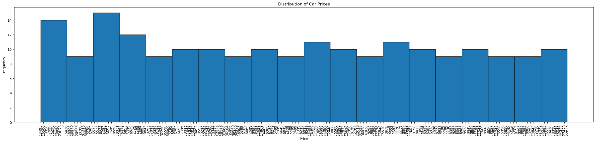
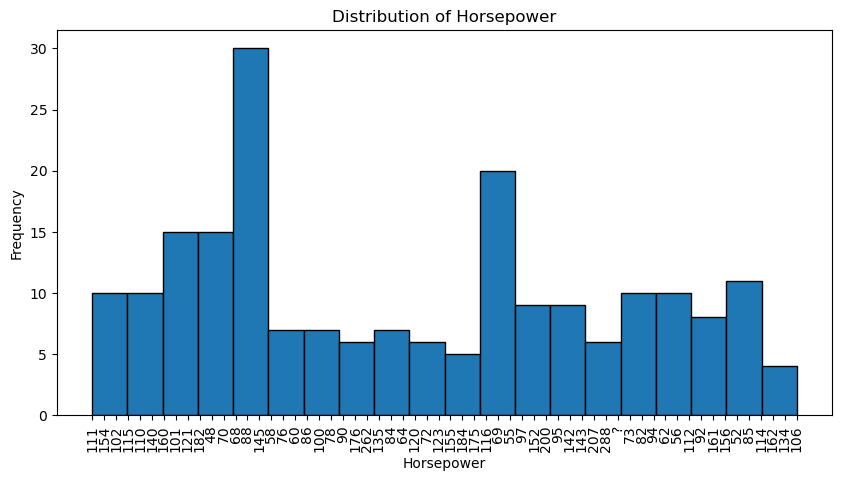
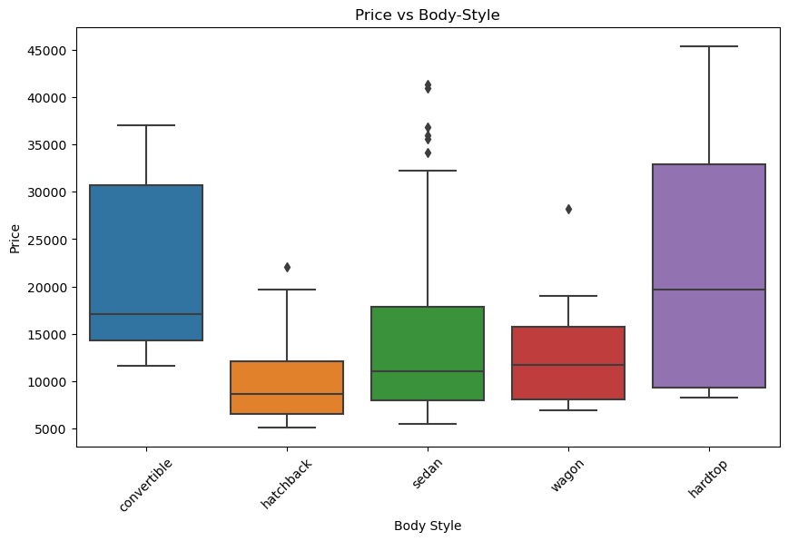
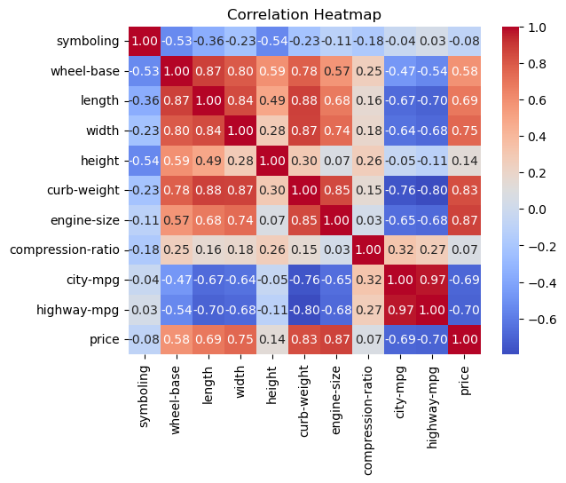
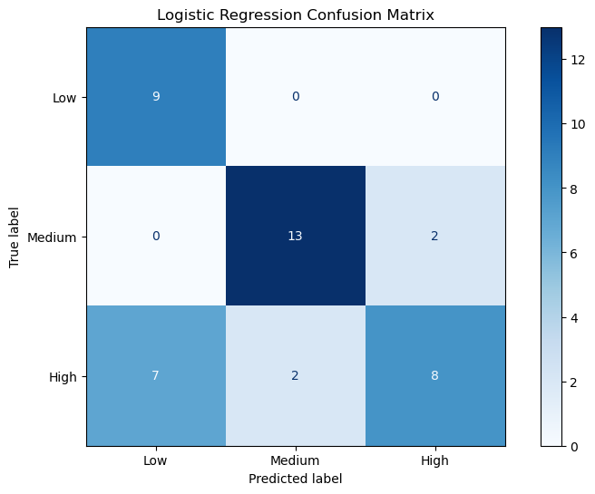
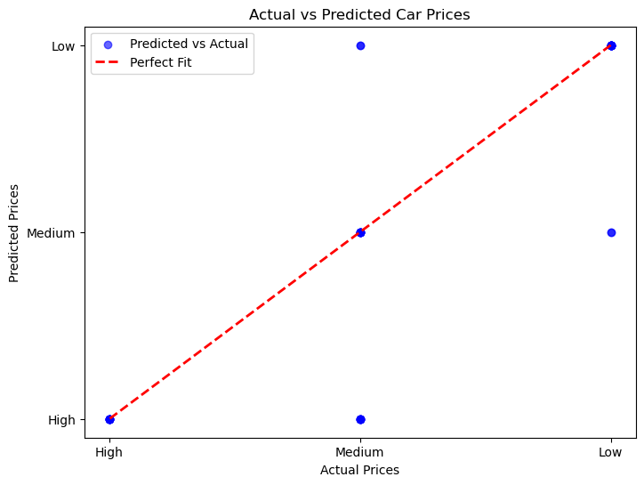
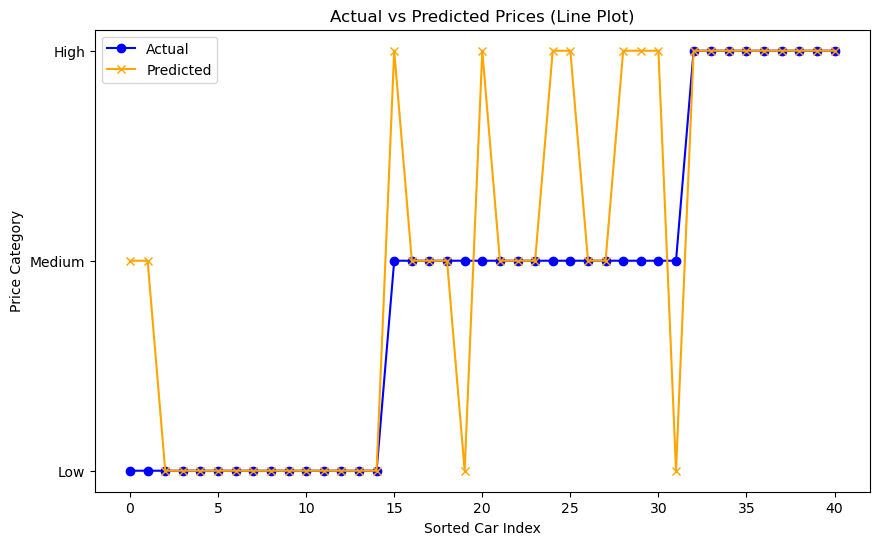

# Car Price Prediction using Data Analytics and Machine Learning

## 📌 Overview
This project predicts car prices using the **Automobile dataset** by applying data analytics and machine learning techniques.  
It explores the relationships between car features (engine size, horsepower, body style, fuel efficiency, etc.) and price and builds regression and classification models to evaluate performance.

---

## 📊 Project Workflow

### 1. Exploratory Data Analysis (EDA)
We explored the dataset with descriptive statistics and visualizations.

**Distribution of Car Prices**  


**Distribution of Horsepower**  


**Price vs Body Style**  


**Correlation Heatmap**  


---

### 2. Data Preprocessing & Feature Engineering
- Handling missing values (`? → NaN → mean/mode replacement`)
- Type conversions (Price, Horsepower → float)
- Feature engineering (fuel efficiency, horsepower binning)
- Normalization

---

### 3. Regression Models
- **Linear Regression** (baseline)
- **Random Forest Regressor** (non-linear, improved performance)
- Evaluation: R², MAE, MSE

---

### 4. Classification Model
We categorized cars into **Low, Medium, High** price ranges using Logistic Regression.

**Confusion Matrix (Logistic Regression)**  


---

### 5. Model Evaluation & Visualization
We compared actual vs predicted values using scatter and line plots.

**Scatter Plot (Actual vs Predicted Prices)**  


**Line Plot (Actual vs Predicted Categories)**  


---

### 6. Business Insights & Recommendations
- Engine size, curb weight and width drive higher prices.
- Luxury body styles (convertibles, hardtops) command premium pricing.
- Fuel efficiency negatively correlates with price.
- Customers can use the model to estimate affordability categories.

---

### 7. Conclusion
- **Random Forest** outperforms Linear Regression (R² ≈ 0.93).
- Logistic Regression achieves ~73% accuracy.
- Limitations: small dataset, overlapping categories.
- Improvements: cross-validation, advanced models, larger dataset.

---

## 🛠️ Installation
Clone the repository and install dependencies:
```bash
git clone https://github.com/PratikG091202/car-price-prediction-ml.git
cd car-price-prediction-ml
pip install -r requirements.txt

📈 Results
Linear Regression: R² ≈ 0.71, MAE ≈ 0.07

Random Forest Regressor: R² ≈ 0.93, MAE ≈ 0.037

Logistic Regression Classification: Accuracy ≈ 73%

📂 Project Structure

├── README.md
├── Car-Price-Prediction-ml.ipynb   <- main notebook
├── histogram_price.png
├── histogram_horsepower.png
├── boxplot_bodystyle.png
├── correlation_heatmap.png
├── confusion_matrix_logistic.png
├── scatter_actual_vs_pred.png
├── lineplot_actual_vs_pred.png
├── references/                     <- supporting docs
├── reports/                        <- final report
├── requirements.txt                <- Python dependencies

📚 References
IBM Developer Skills Network Automobile Dataset

👨‍🎓 Author
Pratik Prakash Gawde  
MSc Data Analytics Student, BSBI (Berlin School of Business & Innovation)
