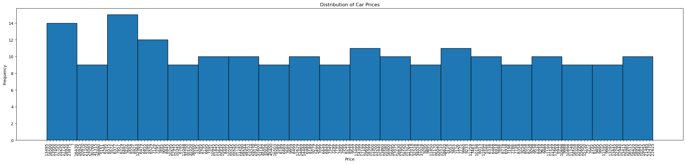
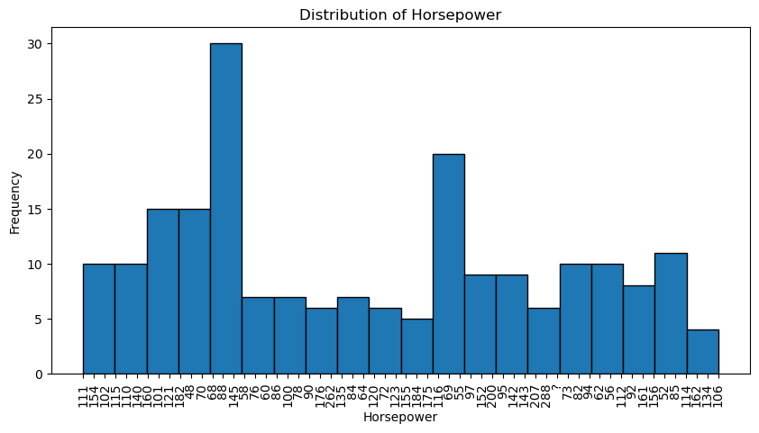
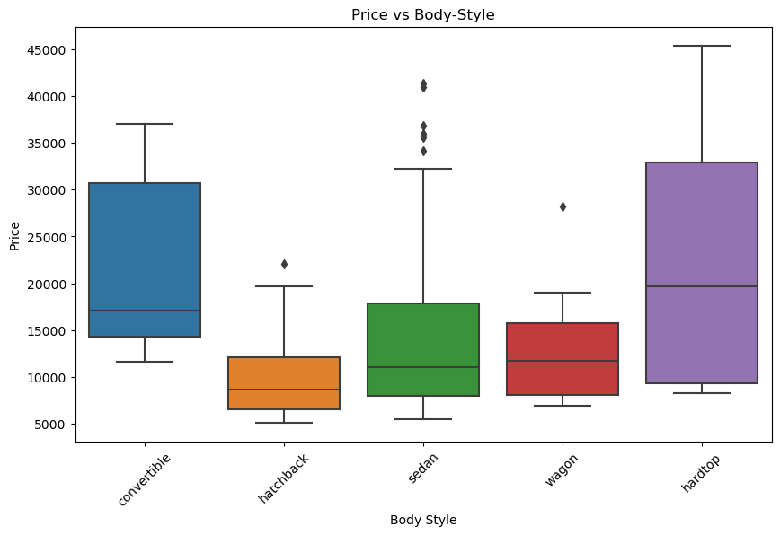
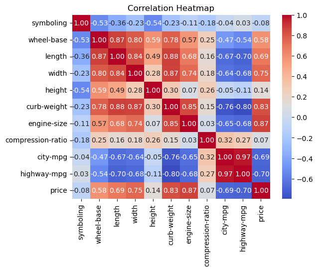
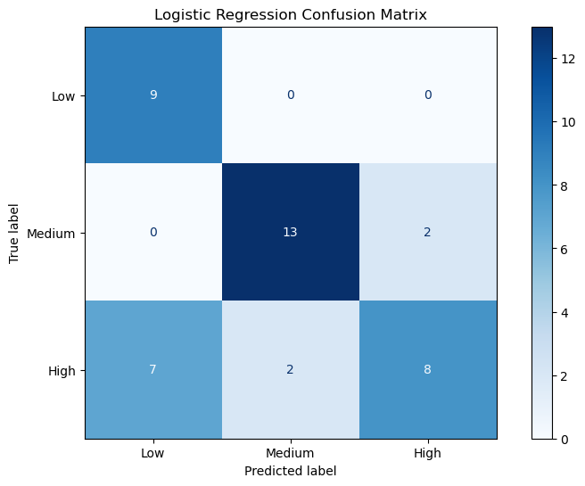
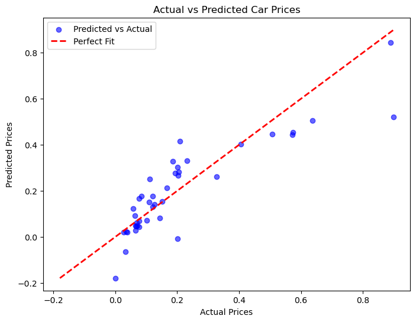
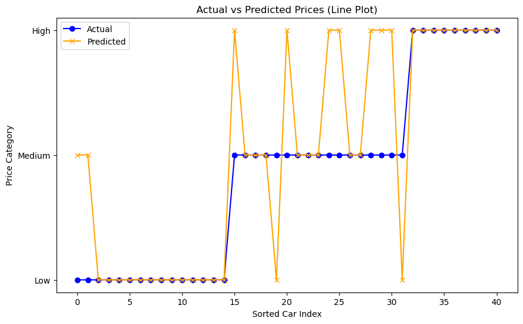

# Car Price Prediction using Data Analytics and Machine Learning

## 📌 Project Overview

This project analyses a car price dataset provided as part of the MSc Data Analytics assignment material. The main aim of the project is to understand which vehicle features affect car prices and to build machine learning models that can predict or classify car prices.

The project uses data analytics, exploratory data analysis, preprocessing, regression modelling and classification. It also explains the business meaning of the results so that the findings can be understood by both technical and non-technical readers.

In simple terms, this project tries to answer the question:

**What makes one car more expensive than another?**

---

## 🎯 Project Objective

The main objectives of this project are:

- To explore the car dataset and understand its structure
- To clean missing and incorrect values
- To study how features such as engine size, horsepower, curb weight and fuel efficiency relate to price
- To build regression models that predict car price
- To build a classification model that groups cars into Low, Medium and High price categories
- To interpret the results from a business and customer point of view

---

## 📂 Dataset Description

The dataset was provided in the assignment material. It contains information about different car attributes such as:

- Car make
- Fuel type
- Body style
- Engine size
- Horsepower
- Curb weight
- City fuel efficiency
- Highway fuel efficiency
- Price

The target variable for the regression task is:

```text
price
```

This means the models try to predict the car price based on other vehicle features.

The dataset contains:

```text
205 rows and 26 columns
```

Each row represents one car record, and each column represents a feature of the car.

---

## 📊 Exploratory Data Analysis

Exploratory Data Analysis was used to understand the dataset before applying machine learning models.

### Distribution of Car Prices



The price distribution shows that many cars are in the lower-to-middle price range, while fewer cars are in the higher price range. This means the dataset contains more economy and mid-range cars than very expensive cars.

### Distribution of Horsepower



The horsepower distribution shows that most cars have moderate horsepower. Only a smaller number of cars have very high horsepower. This suggests that horsepower may influence price, but it is not the only factor.

### Price vs Body Style



The boxplot shows that some body styles, such as convertibles and hardtops, generally appear in higher price ranges. Hatchbacks tend to be cheaper. This shows that design and body style can influence the price of a car.

### Correlation Heatmap



The correlation heatmap shows the relationship between numeric features and price. Engine size, curb weight, width and horsepower have strong positive relationships with price. This means that larger and more powerful cars are usually more expensive.

Fuel efficiency features such as city-mpg and highway-mpg have a negative relationship with price. This means that more fuel-efficient cars in this dataset are generally cheaper, while larger and more powerful cars tend to use more fuel and cost more.

---

## 🧹 Data Preprocessing and Feature Engineering

Before building machine learning models, the dataset was cleaned and prepared.

The preprocessing steps included:

- Replacing missing values marked as `?` with `NaN`
- Identifying columns with missing values
- Filling numeric missing values using the mean
- Filling categorical missing values using the mode
- Converting `price` and `horsepower` into numeric format
- Creating a new fuel-efficiency feature called `city-L/100km`
- Grouping horsepower into Low, Medium and High categories
- Applying Min-Max normalisation to selected numeric columns

These steps were important because machine learning models require clean and numeric data.

---

## 🤖 Regression Model Development

Regression models were used to predict the continuous car price value.

The selected predictor features were:

```text
horsepower, engine-size, curb-weight, width, length, city-mpg, highway-mpg
```

These features were chosen because they showed strong relationships with price during the exploratory analysis.

Two regression models were used:

### 1. Linear Regression

Linear Regression was used as the baseline model. It assumes a simple linear relationship between car features and price.

The model achieved:

```text
R² ≈ 0.77
MAE ≈ 0.074
MSE ≈ 0.011
```

This means Linear Regression explained around 77% of the price variation in the test data. However, it still made larger errors for some higher-priced cars.

### 2. Random Forest Regressor

Random Forest Regressor was used as a stronger model because it can capture non-linear relationships between features.

The model achieved:

```text
R² ≈ 0.93
MAE ≈ 0.037
MSE ≈ 0.003
```

Random Forest performed better than Linear Regression because car price is influenced by several interacting features. For example, engine size, horsepower, body style and curb weight may combine in different ways to affect price.

---

## 📈 Model Comparison

The models were compared using two train-test splits:

- 80% training and 20% testing
- 70% training and 30% testing

The results showed that Random Forest performed better in both splits.

| Model | Split | R² Score | MAE | MSE |
|---|---|---:|---:|---:|
| Linear Regression | 80/20 | 0.77 | 0.074 | 0.011 |
| Random Forest | 80/20 | 0.93 | 0.037 | 0.003 |
| Linear Regression | 70/30 | 0.71 | 0.076 | 0.012 |
| Random Forest | 70/30 | 0.89 | 0.042 | 0.005 |

The 80/20 split gave better performance because more data was available for training.

---

## 🧠 Classification Model

A classification model was also created by converting car prices into three categories:

```text
Low, Medium, High
```

This was done using quantile-based binning so that the categories had nearly equal numbers of records.

Logistic Regression was used for classification.

The model achieved:

```text
Accuracy ≈ 73%
```

### Confusion Matrix



The confusion matrix shows that the model classified Medium-priced cars most accurately. High-priced cars were harder to classify because some of them shared similar technical features with Medium or Low-priced cars.

This suggests that technical features alone may not fully explain premium car pricing. Other factors such as brand reputation, luxury features and market demand may also affect price.

---

## 📊 Model Evaluation and Visualisation

### Actual vs Predicted Prices



The scatter plot compares actual and predicted price values from the Linear Regression model. Points close to the red dashed line represent better predictions. Points farther away from the line show larger prediction errors.

The plot shows that Linear Regression gives reasonable predictions for many lower-priced cars, but it is less accurate for some higher-priced cars.

### Actual vs Predicted Categories



The line plot compares actual and predicted price categories from the Logistic Regression model. Where the lines overlap, the prediction is correct. Where the lines separate, the model has misclassified the car.

The plot supports the confusion matrix result. Medium-category predictions are more consistent, while boundary cases between Low, Medium and High are harder to classify.

---

## 💼 Business Insights and Recommendations

The analysis provides several useful business insights.

### What Makes a Car Expensive?

The features most strongly related to price are:

- Engine size
- Curb weight
- Width
- Horsepower
- Body style

Cars with larger engines, heavier weight and higher horsepower usually cost more. Convertibles and hardtops also tend to appear in higher price ranges.

### Which Features Should Companies Focus On?

Car companies should focus on performance, vehicle size and body style when positioning cars in the premium market. Larger engines, higher horsepower and wider or heavier vehicle designs are linked with higher prices.

For economy customers, companies may focus more on fuel efficiency, affordability and practical body styles.

### How Can Customers Use This Model?

Customers can use this model as a guide when comparing cars. For example, if two cars have similar prices, customers can compare features such as engine size, horsepower, curb weight and fuel efficiency to understand which car may offer better value.

However, the model should not be used as the only decision-making tool because real car prices are also affected by brand reputation, mileage, condition, safety features and market demand.

---

## ✅ Conclusion

The project shows that machine learning can be used to understand and predict car prices based on vehicle features.

The main findings are:

- Engine size, curb weight, width and horsepower are strongly related to price.
- Fuel efficiency has a negative relationship with price in this dataset.
- Random Forest Regressor performed better than Linear Regression.
- Logistic Regression achieved around 73% accuracy for price category classification.
- Technical features explain much of the price variation, but not all real-world pricing factors are included in the dataset.

The best-performing regression model was Random Forest Regressor, with an R² score of approximately 0.93 on the 80/20 split.

---

## ⚠️ Limitations

The project has some limitations:

- The dataset is small, with only 205 records.
- Some real-world pricing factors are not included.
- Brand reputation, mileage, vehicle condition and market demand are not fully captured.
- The classification model struggles with overlapping categories.
- The results may not fully represent current car market conditions.

---

## 🔮 Future Improvements

Future work could improve the project by:

- Using a larger and more recent dataset
- Applying cross-validation
- Testing XGBoost or other boosting models
- Adding more features such as mileage, age, safety rating and brand value
- Improving classification performance for High-priced cars

---

## 🛠️ Installation

Clone the repository and install the required dependencies:

```bash
git clone https://github.com/PratikG091202/car-price-prediction-ml.git
cd car-price-prediction-ml
pip install -r requirements.txt
```

---

## ▶️ How to Run

Open the Jupyter Notebook:

```bash
jupyter notebook Car-Price-Prediction-ml.ipynb
```

Run the notebook cells in order to reproduce the preprocessing steps, visualisations and model results.

---

## 📈 Final Results Summary

| Task | Result |
|---|---|
| Best Regression Model | Random Forest Regressor |
| Best Regression R² Score | Approximately 0.93 |
| Linear Regression R² Score | Approximately 0.77 |
| Classification Model | Logistic Regression |
| Classification Accuracy | Approximately 73% |

---

## 📂 Project Structure

```text
├── README.md
├── Car-Price-Prediction-ml.ipynb
├── histogram_price.png
├── histogram_horsepower.png
├── boxplot_bodystyle.png
├── correlation_heatmap.png
├── confusion_matrix_logistic.png
├── scatter_actual_vs_pred1.png
├── lineplot_actual_vs_pred.png
├── references/
├── reports/
└── requirements.txt
```

---

## 📚 Dataset

The dataset was provided as part of the MSc Data Analytics assignment material.

---

## 👨‍🎓 Author

Pratik Prakash Gawde  
MSc Data Analytics Student  
BSBI – Berlin School of Business and Innovation
